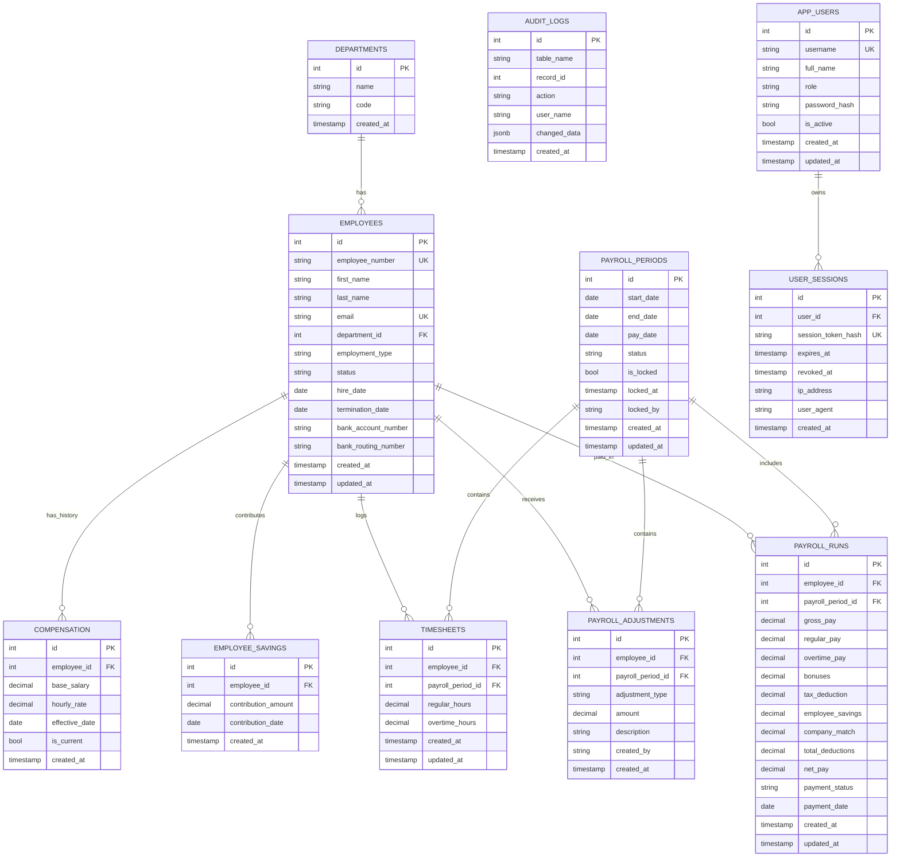

## Payroll Management System

Internal payroll management app built with Rust (`axum`) + PostgreSQL.

## Local Run

1. Set `DATABASE_URL` in `.env`.
2. Optional: set `RUN_MIGRATIONS_ON_STARTUP=false` if you want to skip startup migrations.
3. Start PostgreSQL.
4. Run:

```bash
cargo run
```

The server runs on `http://localhost:9000`.

Health endpoints:
- `GET /health` (liveness)
- `GET /ready` (readiness + DB check)

## Docker (Self-Hosted)

Start app + database:

```bash
docker compose up --build
```

The app is exposed on `http://localhost:9000` and runs migrations on startup.

## Database Schema (ERD)


