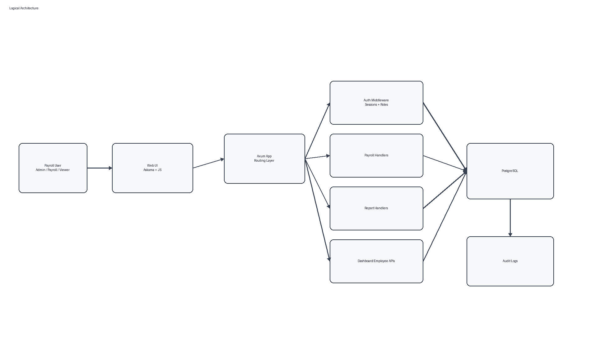
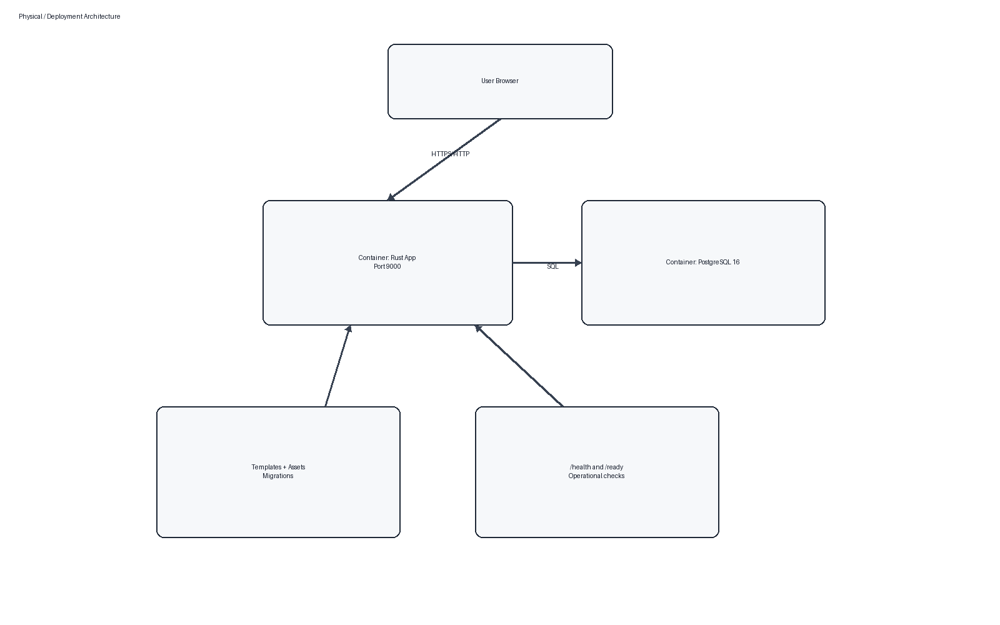
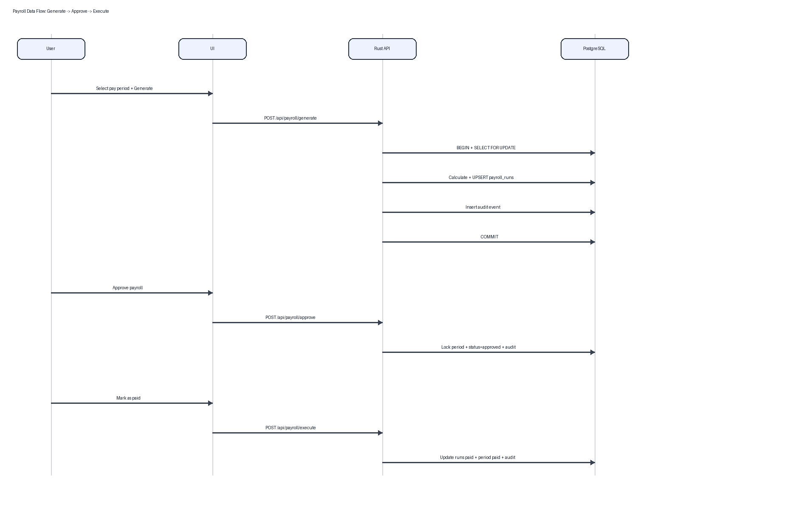

# Payroll Management System for Belize Organizations
## Final Development and Reflection Report (Phase 3)

**Student:** Asher D. Mckoy  
**Student ID:** 92124645  
**Module:** PCSP  
**Submission:** Phase 3 Finalization  
**Date:** February 2026

---

## Abstract

This project developed a self-hosted Payroll Management System tailored to operational realities in Belizean organizations, where payroll processing is often fragmented across manual records and spreadsheets. The final system was implemented with Rust (`axum`) and PostgreSQL, with a focus on correctness, auditability, and maintainability. Core delivered capabilities include authenticated access control, payroll period lifecycle processing (generate, approve/lock, execute), audit event tracking, and multi-format reporting (PDF/CSV).

The development process followed an iterative progression from architecture definition to backend workflow implementation, followed by frontend integration and reporting features. One of the strongest outcomes was the depth of transaction-safe payroll logic: row-level locks, state transition validation, and constrained schema rules were used to protect financial data integrity. The use of Decimal arithmetic in payroll computations also improved confidence in financial correctness compared with floating-point alternatives.

A key insight from the project is that payroll systems should prioritize data and workflow integrity first, because usability and reporting quality become more reliable when the underlying domain model is strict and explicit. Another insight is that technical quality alone is not sufficient for academic and practical completeness; architecture visualization, usability narrative, and reflective analysis are equally important for demonstrating full project maturity.

Several trade-offs emerged during development. Choosing Rust provided performance and safety advantages but introduced a steeper learning and delivery curve for rapid UI iteration compared with higher-level frameworks. Choosing self-hosting improved data control and local adaptability, but shifted operational responsibility (TLS, backup, monitoring, credential policy) to the deploying institution.

If this project were repeated, the following changes would be made earlier in the timeline: first, include architecture diagrams and evaluation structure from the beginning rather than final-phase consolidation; second, formalize usability feedback sessions with representative users; third, prioritize production hardening tasks such as TLS, CSRF protection, and credential lifecycle controls as core milestones rather than end-stage enhancements.

Overall, the project achieved its primary objectives and produced a technically credible payroll platform suitable for pilot deployment. The final phase strengthened completeness through reflection, visual documentation, and objective-based evaluation, while also identifying a clear roadmap for production readiness and long-term sustainability.

---

## 1. Introduction and Context

This project addresses operational weaknesses in manual or spreadsheet-driven payroll workflows used by small and medium organizations in Belize. These weaknesses include delayed payroll processing, weak auditability, inconsistent deductions, and limited reporting capability for management and compliance.

The final system is a self-hosted payroll web application built with Rust (`axum`) and PostgreSQL. It supports payroll period processing, approval/locking workflow, execution (marking paid), reporting, and authenticated access control.

Phase 2 feedback confirmed strong technical depth and implementation maturity. Phase 3 focuses on completeness, reflection, visual documentation, and clearer evaluation against project objectives.

---

## 2. Feedback Integration Summary

Phase 3 directly addresses the tutor feedback as follows:

| Feedback Area | Phase 3 Response |
|---|---|
| Missing visual architecture documentation | Added logical, physical/deployment, and data flow diagrams |
| Limited reflection on trade-offs and risks | Added dedicated critical reflection, risk, and limitations sections |
| Frontend/usability under-explained | Added user workflow walkthrough with screenshots |
| Need for scalability/security discussion | Added security and scalability analysis with practical constraints |
| Need for deployment feasibility context | Added Belize deployment feasibility section |
| Need for clear objective evaluation | Added objective-by-objective evaluation matrix |

---

## 3. Final System Architecture

### 3.1 Logical Architecture

### 3.2 Physical/Deployment Architecture

### 3.3 Payroll Data Flow (Generate -> Approve -> Execute)

---

## 4. Implementation Status and Technical Depth

### 4.1 Backend and API

The backend is modularized into handlers by domain (`auth`, `payroll`, `reports`, `api`), with route composition in `src/main.rs`. Core protected routes include:

- `/api/payroll/generate`, `/api/payroll/approve`, `/api/payroll/execute`
- `/api/payroll/periods`, `/api/payroll/period-details`, `/api/payroll/audit`
- `/api/reports/options`, `/api/reports/generate`
- `/api/dashboard/overview`, `/api/employees`, `/api/payroll-breakdown`

Health endpoints (`/health`, `/ready`) are exposed for operational monitoring.

### 4.2 Database and Governance

The schema is normalized and enforces key business rules through:

- Relational integrity (foreign keys across employees, periods, runs, adjustments, sessions)
- Domain constraints (`CHECK` constraints for statuses, dates, positive monetary values)
- Uniqueness constraints (e.g., one payroll run per employee per period)
- Locking metadata on payroll periods (`is_locked`, `locked_at`, `locked_by`)
- Audit logging via `audit_logs` with JSON payloads for event detail
- Supporting indexes for payroll status/date, employee dimensions, and audit queries

### 4.3 Payroll Engine

The payroll engine is implemented in `src/handlers/payroll.rs` using `Decimal` arithmetic for financial correctness.

Core logic includes:

- Employment-type-aware gross pay rules (salaried, hourly, contractor)
- Overtime multiplier for hourly workers
- Tax calculation with allowance and rate rules
- Savings contribution processing with deduction-cap protection
- Company-match cap logic (annual limit enforcement)
- Upsert strategy to avoid duplicate run rows (`ON CONFLICT`)
- Transactional workflow with row-level period locking (`FOR UPDATE`)

Complexity is linear to active employees in a payroll period, i.e., **O(n)**.

---

## 5. Security Considerations

### 5.1 Implemented Controls

- Password hashing with Argon2
- Random session token generation using cryptographic randomness
- Session token hashing (SHA-256) before database storage
- Cookie protections: `HttpOnly`, `SameSite=Lax`, configurable `Secure` flag (`COOKIE_SECURE`)
- Role-aware authorization for payroll actions (`admin` and `payroll` roles)
- Server-side validation of payroll state transitions before mutating data
- Audit events for payroll lifecycle actions

### 5.2 Security Gaps and Final-Phase Assessment

Current limitations:

- HTTPS/TLS is implemented for Docker deployment through an optional reverse-proxy profile (`docker-compose.https.yml` with Caddy `tls internal`)
- No CSRF token strategy is implemented for state-changing form/API requests
- No rate limiting or account lockout policy is currently enforced
- Default admin bootstrap credentials must be replaced in production

Phase 3 conclusion: the baseline security model is sound for controlled/internal deployment, but internet-exposed deployment still requires production certificate management, hardened authentication policy, and reverse-proxy controls.

---

## 6. Scalability and Reliability

### 6.1 Current Scalability Posture

The application uses async request handling, pooled PostgreSQL connections, and an efficient compiled language runtime (Rust). For the project scope (small-to-medium payroll operations), this is sufficient and operationally efficient.

### 6.2 Reliability Features

- Transactional boundaries around payroll lifecycle operations
- State-locking rules to prevent invalid transitions
- Readiness endpoint with live DB check
- Containerized app/database startup sequence with health checks
- Idempotent upsert behavior for payroll run regeneration

### 6.3 Practical Bottlenecks

- Single app instance and monolithic deployment pattern
- Limited database pool size in current configuration
- Report generation currently executed in request path (no background queue)

---

## 7. User Workflow and UI Walkthrough

The final UI supports the complete payroll operations path.

### 7.1 Login and Access

Users authenticate through the login page and receive a session cookie for protected routes.

\begin{center}
\includegraphics[width=0.95\linewidth]{../screenshots/login-page.png}
\end{center}
\begin{center}\footnotesize\textit{Figure 7.1: Login page}\end{center}

### 7.2 Dashboard Overview

The dashboard summarizes payroll totals, tax/deduction activity, employee count, pay period context, and recent payroll activity.

\begin{center}
\includegraphics[width=0.95\linewidth]{../screenshots/dashboard-page.png}
\end{center}
\begin{center}\footnotesize\textit{Figure 7.2: Dashboard overview}\end{center}

### 7.3 Payroll Processing Workflow

The payroll screen guides users through:

1. Select pay period  
2. Generate payroll  
3. Approve and lock payroll  
4. Mark payroll as paid  
5. Review audit trail and employee status

\begin{center}
\includegraphics[width=0.95\linewidth]{../screenshots/payroll-page.png}
\end{center}
\begin{center}\footnotesize\textit{Figure 7.3: Payroll processing page overview}\end{center}

\begin{center}
\includegraphics[width=0.95\linewidth]{../screenshots/generate-payroll-clicked.png}
\end{center}
\begin{center}\footnotesize\textit{Figure 7.4: Generate payroll action result}\end{center}

\begin{center}
\includegraphics[width=0.95\linewidth]{../screenshots/approve-payroll-clicked.png}
\end{center}
\begin{center}\footnotesize\textit{Figure 7.5: Approve and lock payroll action result}\end{center}

\begin{center}
\includegraphics[width=0.95\linewidth]{../screenshots/mark-as-paid-clicked.png}
\end{center}
\begin{center}\footnotesize\textit{Figure 7.6: Mark payroll as paid action result}\end{center}

### 7.4 Employee and Reporting Workflows

Employees page provides payroll-oriented employee visibility (status, net pay, tax, contributions), with per-row detail cards.

\begin{center}
\includegraphics[width=0.95\linewidth]{../screenshots/employees-page.png}
\end{center}
\begin{center}\footnotesize\textit{Figure 7.7: Employees page with profile details}\end{center}

Reports are organized by category (Employee, Payroll, Compliance), with context-driven filters and export options.

\begin{center}
\includegraphics[width=0.95\linewidth]{../screenshots/reports-page-employees.png}
\end{center}
\begin{center}\footnotesize\textit{Figure 7.8: Reports page (Employee category)}\end{center}

\begin{center}
\includegraphics[width=0.95\linewidth]{../screenshots/reports-page-payroll.png}
\end{center}
\begin{center}\footnotesize\textit{Figure 7.9: Reports page (Payroll category)}\end{center}

\begin{center}
\includegraphics[width=0.95\linewidth]{../screenshots/reports-page-compliance.png}
\end{center}
\begin{center}\footnotesize\textit{Figure 7.10: Reports page (Compliance category)}\end{center}

\begin{center}
\includegraphics[width=0.95\linewidth]{../screenshots/preview-report-clicked.png}
\end{center}
\begin{center}\footnotesize\textit{Figure 7.11: Report generation preview modal}\end{center}

---

## 8. Testing and Evaluation

### 8.1 Automated Tests (Current Repository State)

`cargo test` passes with four active tests:

- Payroll tax rule unit test
- Company-match cap unit test
- Company-match exhausted-cap unit test
- Database pool creation test

Result at finalization: **4 passed, 0 failed**.

### 8.2 Workflow Validation

Workflow correctness was validated through:

- Payroll state transitions (`processing -> approved/locked -> paid`)
- Audit trail verification for generate/approve/execute events
- UI action confirmations matching backend responses
- Phase 2 documented integration-path verification and rollback behavior for transactional failure scenarios

### 8.3 Performance Evidence

Phase 2 benchmarks were executed locally against the release binary with `wrk (-t2 -c20 -d5s --latency)` and no non-2xx responses were recorded.

1. Endpoint: `/health`  
   Req/sec: 165,636.55 | Avg: 107.50us | P90: 187.00us | P99: 286.00us | Note: Liveness baseline
2. Endpoint: `/ready`  
   Req/sec: 27,080.09 | Avg: 734.53us | P90: 0.87ms | P99: 0.96ms | Note: Includes DB check
3. Endpoint: `/api/dashboard/overview`  
   Req/sec: 3,002.98 | Avg: 6.65ms | P90: 8.19ms | P99: 8.92ms | Note: Read-heavy aggregation
4. Endpoint: `/api/employees`  
   Req/sec: 6,121.86 | Avg: 3.26ms | P90: 4.02ms | P99: 4.75ms | Note: Employee listing payload
5. Endpoint: `/api/payroll-breakdown?year=2026`  
   Req/sec: 9,533.79 | Avg: 2.07ms | P90: 2.46ms | P99: 2.70ms | Note: Chart aggregation endpoint
6. Endpoint: `/api/payroll/periods`  
   Req/sec: 11,329.02 | Avg: 1.74ms | P90: 2.06ms | P99: 2.23ms | Note: Payroll period selection
7. Endpoint: `/api/reports/options`  
   Req/sec: 6,644.79 | Avg: 3.01ms | P90: 3.46ms | P99: 4.08ms | Note: Report filter metadata

---

## 9. Critical Reflection on Design Trade-offs

### 9.1 Rust + Axum vs Higher-Level Frameworks

**Advantages realized:**

- Strong memory safety and type safety in core payroll logic
- Good performance profile with async concurrency
- High confidence in financial calculation stability using `Decimal`

**Costs observed:**

- Longer implementation time for UI-heavy features compared to rapid frameworks
- Higher onboarding complexity for contributors less familiar with Rust ecosystem

### 9.2 Self-Hosting vs SaaS Payroll Platform

**Self-hosted benefits:**

- Data control and local governance flexibility
- Lower recurring licensing dependence
- Better adaptation for institution-specific payroll rules

**Self-hosted constraints:**

- Institution must handle operations (backup, patching, TLS, monitoring)
- Limited built-in compliance support compared to mature SaaS offerings

### 9.3 Monolith vs Distributed Services

A monolithic architecture was intentionally chosen for scope control and delivery speed. This reduced operational overhead and simplified deployment for Phase 2/3 objectives. A microservice split is not justified yet at current scale.

---

## 10. Belize Deployment Feasibility

The system is feasible for deployment in Belizean small-to-medium organizations under these assumptions:

- Stable local network or low-latency internet link for office users
- One managed host (on-premises or cloud VM) with Docker support
- Basic operational ownership for backups, credential rotation, and patching

Practical strengths for local feasibility:

- No dependency on expensive SaaS subscription tiers
- Straightforward stack (web app + PostgreSQL)
- Containerized deployment simplifies reproducibility

Operational requirements before production:

- TLS reverse proxy and certificate automation
- Backup and disaster recovery policy
- Strong secret management (no default credentials)

---

## 11. Evaluation Against Initial Objectives

| Initial Objective | Final Status | Evidence |
|---|---|---|
| Centralize payroll operations | Achieved | Unified dashboard, payroll, employee, and reporting modules |
| Enforce accurate payroll calculation | Achieved | Decimal math, deduction constraints, match-cap logic |
| Provide auditable payroll lifecycle | Achieved | `audit_logs` events + payroll audit endpoint |
| Support management/compliance reporting | Achieved | Multiple report types with PDF/CSV export |
| Ensure deployability in constrained environments | Partially achieved | Dockerized deployment is complete, including optional HTTPS mode; production certificate trust/automation remains to be hardened |
| Provide complete employee administration UI | Partially achieved | Employee visibility is implemented; add-employee UI is pending |

---

## 12. Limitations, Risks, and Future Work

### 12.1 Current Limitations

- HTTPS/TLS is available in Docker mode, but production-grade certificate provisioning/trust management is not finalized
- No employee creation/edit workflow from UI (read/report-centric employee module)
- Report generation currently in-request (no async job queue)
- No complete formal usability study with external user groups

### 12.2 Key Risks

- Security risk if deployed publicly without TLS and stricter auth hardening
- Operational risk if backup/restore procedures are not institutionalized
- Maintainability risk if future local tax/regulation changes are not tracked in rules

### 12.3 Priority Improvements

1. Add TLS termination (e.g., reverse proxy with certificate automation)  
2. Implement employee create/edit forms with validation and audit logging  
3. Add CSRF and rate-limiting controls  
4. Expand automated tests to include API integration/state transition suites  
5. Add asynchronous report export for heavy datasets

---

## 13. Lessons Learned and Project Management Reflection

Major lessons from end-to-end delivery:

- A strict, stateful payroll workflow (generate/approve/execute) reduces financial error risk more effectively than ad hoc processing flows.
- Building correctness into schema constraints and transactional boundaries is critical for payroll systems.
- Early focus on backend rigor was beneficial, but frontend/usability narrative needed stronger evidence and clearer communication.
- Phase 2 demonstrated technical maturity; Phase 3 required stepping back to improve academic framing, reflection depth, and presentation quality.

If restarting the project:

- Plan architecture diagrams and reporting artifacts from early milestones
- Introduce usability checkpoints with real users earlier
- Treat security hardening tasks (TLS, anti-CSRF, credential policy) as first-class deliverables, not final-step polish

---

## 14. Reproducibility and Repository Link

Public GitHub repository: **https://github.com/AsherDMckoy/Payroll-System-Belize**

ZIP export prepared for submission: `deliverable/Mckoy-Asher_92124645_PCSP_P3_S_GitHub_Repository.zip`

Repository must include:

- Complete source code and migration files
- Docker deployment configuration
- `README.md` setup/run instructions
- Screenshots and report artifacts used in this submission

---

## 15. Conclusion

The project has reached a stable and demonstrable final phase with a working payroll backend, normalized database design, stateful payroll workflow, authentication/session handling, audit logging, and report export capabilities. The final report addresses prior feedback by adding complete architecture visuals, user workflow documentation, explicit trade-off reflection, security/scalability analysis, and objective-based evaluation.

This system is suitable for pilot deployment in Belizean organizational contexts, with immediate next-step hardening centered on TLS integration and expanded administrative UX.

---

## References

1. Axum Web Framework. https://github.com/tokio-rs/axum  
2. Tokio Async Runtime. https://tokio.rs/  
3. SQLx. https://github.com/launchbadge/sqlx  
4. PostgreSQL. https://www.postgresql.org/  
5. Rust Decimal. https://docs.rs/rust_decimal  
6. Argon2 (Rust crate). https://docs.rs/argon2  
7. Docker. https://www.docker.com/  
8. Askama Templates. https://github.com/askama-rs/askama  
9. Muratori, C. Performance-Aware Programming (series). https://www.computerenhance.com/p/table-of-contents  
10. Muratori, C. Performance-Aware Programming videos. https://www.youtube.com/@MollyRocket  
